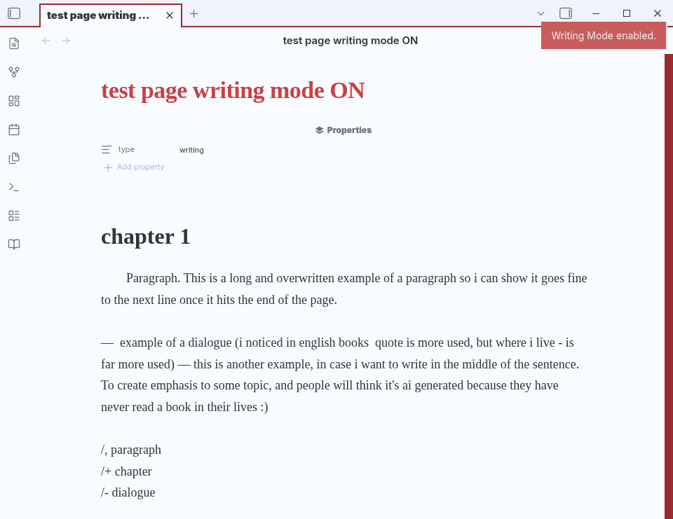
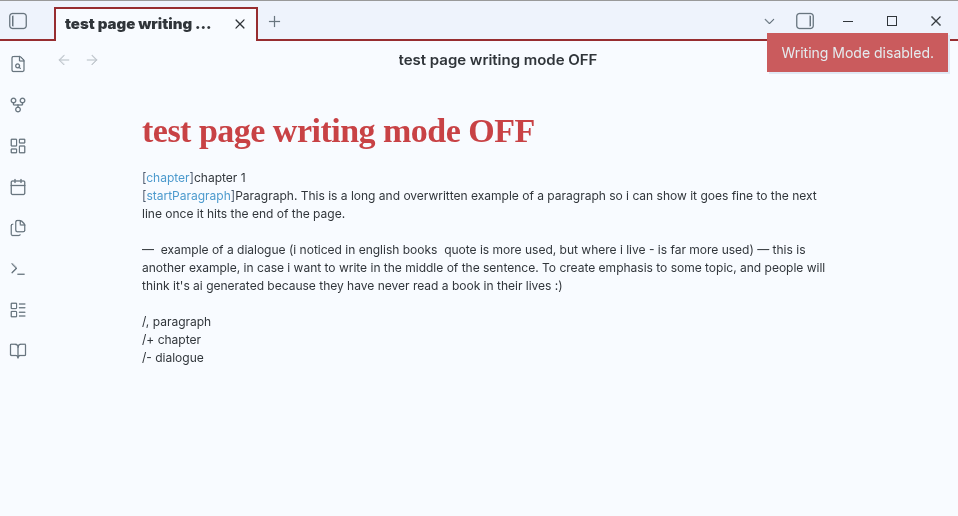

# Simple Writing

A writing-focused editor for [Obsidian](https://obsidian.md/), designed for long-form writing while keeping Markdown as the source of truth.

Simple Writing provides a cleaner, more focused writing environment without changing the underlying Markdown file.

**With writing mode enabled**


**With writing mode disabled**

## Features

* Distraction-free Writing Mode
* Book-like typography and layout
* Chapter formatting
* Paragraph indentation
* Dialogue shortcuts
* Markdown remains the source of truth
* Works directly with standard Obsidian Markdown files


## Writing Mode

Writing Mode provides a dedicated layout for long-form writing.

When enabled, the editor uses a wider writing area, larger typography, and formatting designed to make long texts more comfortable to write and read.

Writing Mode is enabled on files containing:

```yaml
type: writing
```

You can toggle Writing Mode using the book icon in the ribbon.

## Writing Markers

Simple Writing uses small Markdown-compatible markers to control certain formatting behaviors.

### Chapters

Add a chapter using:

```text
[chapter] Chapter 1
```

In Writing Mode, the `[chapter]` marker is hidden and the chapter title receives special formatting.

### Paragraph indentation

Add a paragraph indentation using:

```text
[startParagraph] Sofia entered the forest.
```

In Writing Mode, the `[startParagraph]` marker is hidden and the paragraph receives a first-line indentation.

These markers remain part of the Markdown source, so the underlying file is never locked into a proprietary format.

## Writing Shortcuts

Writing Mode provides shortcuts for common writing actions.

| Shortcut    | Action                      |
| ----------- | --------------------------- |
| `/,`        | Start an indented paragraph |
| `/-`        | Insert dialogue             |
| `/+`        | Insert a chapter            |
| `/dialogue` | Insert dialogue             |

### Example

Typing:

```text
/,Sofia entered the forest.
```

creates:

```text
[startParagraph] Sofia entered the forest.
```

Typing:

```text
/-Where are you going?
```

creates:

```text
— Where are you going?
```

Typing:

```text
/+Chapter 1
```

creates:

```text
[chapter] Chapter 1
```

Shortcuts are only active while Writing Mode is enabled.

## Markdown First

Simple Writing is designed to work **with** Markdown, not replace it.

Your `.md` files remain regular Obsidian Markdown files and can still be opened and edited normally, even without Simple Writing.

The plugin only changes how writing files are presented and provides optional writing markers and shortcuts.

## Installation

Once Simple Writing is available in the Obsidian Community Plugins directory:

1. Open **Settings → Community plugins**.
2. Select **Browse**.
3. Search for **Simple Writing**.
4. Install the plugin.
5. Enable it.

## Compatibility

Simple Writing is designed for Obsidian and works with standard Markdown files.

## Roadmap

Planned features include:

* EPUB export
* Additional writing shortcuts
* Scene breaks
* Additional writing block types
* Improved navigation for long-form projects
* More customization options

The roadmap may change as the project develops.

## License

[Choose a license for the project.]
