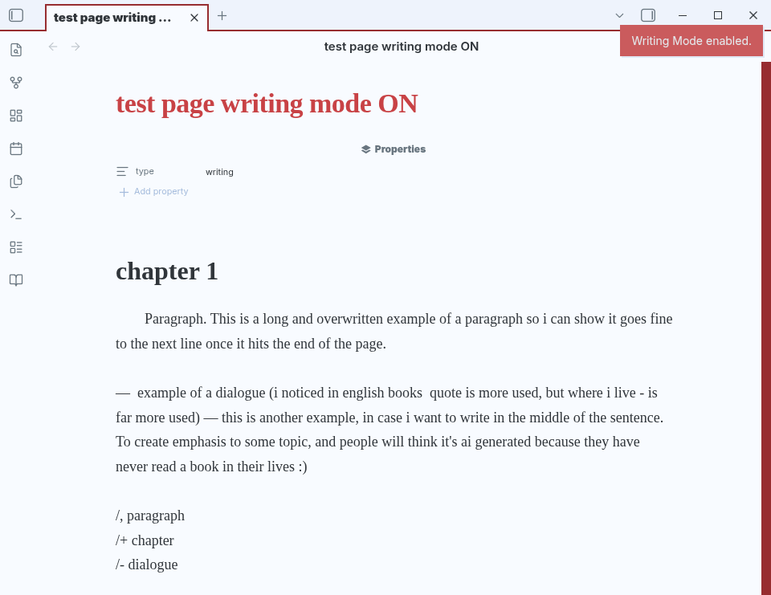
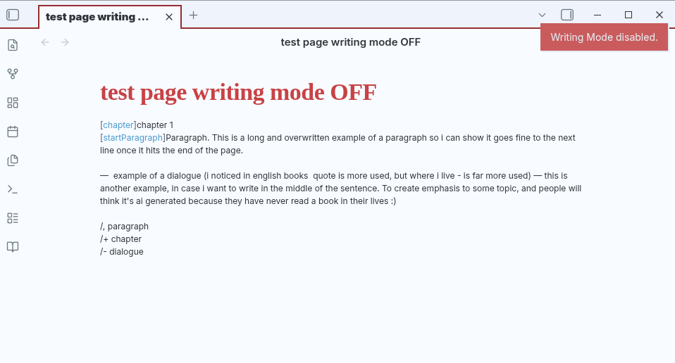

# Simple Writing

A focused writing experience for Obsidian, built for long-form writing while keeping Markdown as the source of truth.
 
Simple Writing enhances readability with book-like formatting, chapter support, paragraph indentation, and writing shortcuts, all while working directly with standard Markdown files.

**With writing mode enabled**


**With writing mode disabled**


## Features
 
- Distraction-free Writing Mode
- Book-style typography and layout
- Chapter formatting
- Paragraph indentation
- Writing shortcuts
- Markdown-first approach


## Writing Mode
 
Enable Writing Mode by adding:
 
```yaml
type: writing
```
 
or by clicking the book icon in the ribbon.
 
## Markers
 
### Chapter
 
```text
[chapter] Chapter 1
```
 
### Indented paragraph
 
```text
[startParagraph] Sofia entered the forest.
```
 
Markers are hidden in Writing Mode but remain part of the Markdown source.
 
## Shortcuts
 
| Shortcut | Result |
|-----------|---------|
| `/,` | Indented paragraph |
| `/-` | Dialogue |
| `/+` | Chapter |
| `/dialogue` | Dialogue |
 
### Examples
 
```text
/,Sofia entered the forest.
```
 
becomes:
 
```text
[startParagraph] Sofia entered the forest.
```
 
```text
/+Chapter 1
```
 
becomes:
 
```text
[chapter] Chapter 1
```
 
## Markdown First
 
Files remain standard `.md` documents and can be edited normally, even without the plugin.
 
## Roadmap
 
- EPUB export
- Scene breaks
- Additional writing blocks
- Improved navigation
- More customization options